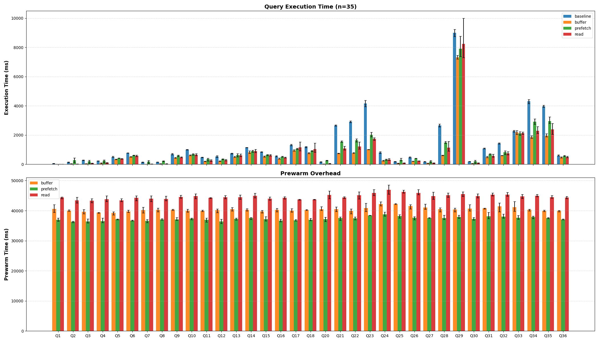

# DuckDB Cache Prewarm

A DuckDB extension that preloads table data blocks into the buffer pool or OS page cache, inspired by PostgreSQL's [`pg_prewarm`](https://www.postgresql.org/docs/current/pgprewarm.html) extension.

## Installation

```sql
FORCE INSTALL cache_prewarm FROM community;
LOAD cache_prewarm;
```

## Usage

```sql
-- Basic usage: prewarm a table into DuckDB's buffer pool
SELECT prewarm('table_name');

-- With explicit mode
SELECT prewarm('table_name', 'buffer');

-- With schema specification
SELECT prewarm('table_name', 'buffer', 'my_schema');
```

## Prewarm Modes

| Mode | Description |
|------|-------------|
| `buffer` | **(Default)** Load blocks into DuckDB's buffer pool with pin/unpin. Blocks stay in the buffer pool until evicted by normal buffer management. |
| `read` | Synchronously read blocks from disk into temporary process memory. This warms the OS page cache but does not use DuckDB's buffer pool. |
| `prefetch` | Issue OS-specific prefetch hints against the database file to warm the OS page cache for the table's blocks. |

## Benchmark

ClickBench benchmark results:



Memory: 31 GB
CPU cores: 16
CPU: AMD EPYC 7282 16-Core Processor

```bash
Query 1: baseline 55.55 ms, buffer mode is 63.0x faster, read mode is 21.1x faster, prefetch mode is 10.2x faster
Query 2: baseline 143.64 ms, buffer mode is 4.02x faster, read mode is 7.32x faster, prefetch mode is 2.01x slower
Query 3: baseline 272.04 ms, buffer mode is 7.04x faster, read mode is 4.00x faster, prefetch mode is 1.34x faster
Query 4: baseline 236.08 ms, buffer mode is 3.35x faster, read mode is 2.40x faster, prefetch mode is 1.02x faster
Query 5: baseline 503.90 ms, buffer mode is 1.48x faster, read mode is 1.35x faster, prefetch mode is 1.19x faster
Query 6: baseline 772.24 ms, buffer mode is 1.51x faster, read mode is 1.36x faster, prefetch mode is 1.24x faster
Query 7: baseline 139.10 ms, buffer mode is 12.2x faster, read mode is 6.23x faster, prefetch mode is 1.38x slower
Query 8: baseline 152.15 ms, buffer mode is 4.06x faster, read mode is 4.53x faster, prefetch mode is 1.48x slower
Query 9: baseline 698.44 ms, buffer mode is 1.61x faster, read mode is 1.47x faster, prefetch mode is 1.20x faster
Query 10: baseline 998.35 ms, buffer mode is 1.62x faster, read mode is 1.52x faster, prefetch mode is 1.43x faster
Query 11: baseline 471.00 ms, buffer mode is 2.29x faster, read mode is 1.83x faster, prefetch mode is 1.33x faster
Query 12: baseline 529.41 ms, buffer mode is 2.37x faster, read mode is 1.90x faster, prefetch mode is 1.49x faster
Query 13: baseline 740.33 ms, buffer mode is 1.48x faster, read mode is 1.23x faster, prefetch mode is 1.18x faster
Query 14: baseline 1.15 s, buffer mode is 1.41x faster, read mode is 1.27x faster, prefetch mode is 1.28x faster
Query 15: baseline 849.22 ms, buffer mode is 1.60x faster, read mode is 1.40x faster, prefetch mode is 1.31x faster
Query 16: baseline 554.66 ms, buffer mode is 1.43x faster, read mode is 1.21x faster, prefetch mode is 1.07x faster
Query 17: baseline 1.32 s, buffer mode is 1.40x faster, read mode is 1.13x faster, prefetch mode is 1.23x faster
Query 18: baseline 1.19 s, buffer mode is 1.55x faster, read mode is 1.15x faster, prefetch mode is 1.30x faster
Query 20: baseline 159.91 ms, buffer mode is 8.28x faster, read mode is 3.17x faster, prefetch mode is 1.60x slower
Query 21: baseline 2.66 s, buffer mode is 3.59x faster, read mode is 2.48x faster, prefetch mode is 1.71x faster
Query 22: baseline 2.91 s, buffer mode is 3.76x faster, read mode is 2.40x faster, prefetch mode is 1.77x faster
Query 23: baseline 4.16 s, buffer mode is 4.11x faster, read mode is 2.39x faster, prefetch mode is 2.05x faster
Query 24: baseline 812.90 ms, buffer mode is 3.41x faster, read mode is 2.55x faster, prefetch mode is 2.55x faster
Query 25: baseline 180.60 ms, buffer mode is 2.91x faster, read mode is 2.26x faster, prefetch mode is 1.70x slower
Query 26: baseline 480.83 ms, buffer mode is 2.27x faster, read mode is 2.04x faster, prefetch mode is 1.19x faster
Query 27: baseline 171.16 ms, buffer mode is 2.50x faster, read mode is 2.23x faster, prefetch mode is 1.20x slower
Query 28: baseline 2.65 s, buffer mode is 4.26x faster, read mode is 2.35x faster, prefetch mode is 1.77x faster
Query 29: baseline 8.99 s, buffer mode is 1.23x faster, read mode is 1.09x faster, prefetch mode is 1.14x faster
Query 30: baseline 189.20 ms, buffer mode is 3.59x faster, read mode is 2.20x faster, prefetch mode is 1.04x slower
Query 31: baseline 1.08 s, buffer mode is 2.20x faster, read mode is 1.86x faster, prefetch mode is 1.58x faster
Query 32: baseline 1.44 s, buffer mode is 2.37x faster, read mode is 1.92x faster, prefetch mode is 1.72x faster
Query 33: baseline 2.26 s, buffer mode is 1.03x faster, read mode is 1.06x faster, prefetch mode is 1.07x faster
Query 34: baseline 4.31 s, buffer mode is 2.31x faster, read mode is 1.89x faster, prefetch mode is 1.48x faster
Query 35: baseline 3.98 s, buffer mode is 2.03x faster, read mode is 1.66x faster, prefetch mode is 1.35x faster
Query 36: baseline 602.01 ms, buffer mode is 1.28x faster, read mode is 1.20x faster, prefetch mode is 1.06x faster
```

Check `bench/README.md` for details.

## Example

```sql
CREATE TABLE events (
    event_id BIGINT,
    user_id INTEGER,
    session_id VARCHAR,
    event_type VARCHAR,
    event_data VARCHAR,
    timestamp TIMESTAMP,
    value DOUBLE
);

INSERT INTO events
SELECT
    i AS event_id,
    (random() * 10000)::INTEGER AS user_id,
    'session_' || (random() * 5000)::INTEGER AS session_id,
    (ARRAY['click', 'view', 'purchase', 'signup', 'logout'])[1 + (random() * 4)::INTEGER] AS event_type,
    'data_' || (random() * 1000)::INTEGER AS event_data,
    '2024-01-01 00:00:00'::TIMESTAMP + INTERVAL (i) SECOND AS timestamp,
    random() * 1000 AS value
FROM range(500000) t(i);

-- Use Checkpoint to ensure the blocks are written to disk or restart the database
CHECKPOINT;
┌─────────┐
│ Success │
│ boolean │
├─────────┤
│ 0 rows  │
└─────────┘

-- Prewarm the duckdb cache for the events table
-- the result is the number of blocks prewarmed, which may vary depending on how the compression is applied to the table
-- NOTICE that, the result is mostly accurate and only for reference
SELECT prewarm('events'); -- or prewarm('events', 'buffer')
┌─────────────────────┐
│ prewarm('events')   │
│        int64        │
├─────────────────────┤
│         17          │
└─────────────────────┘

-- Prewarm the os page cache for the events table using the read strategy
SELECT prewarm('events', 'read');
┌───────────────────────────┐
│ prewarm('events', 'read') │
│           int64           │
├───────────────────────────┤
│            19             │
└───────────────────────────┘

-- Prewarm the os page cache for the events table using the prefetch strategy
-- which will use the OS-specific prefetch hints to prefetch the blocks into the page cache
SELECT prewarm('events', 'prefetch');
┌───────────────────────────────┐
│ prewarm('events', 'prefetch') │
│           int64               │
├───────────────────────────────┤
│              24               │
└───────────────────────────────┘
```

> **Note:** The returned block count may vary depending on compression and data layout. The count is approximate and for reference only.

## When to Use

- **Cold start optimization**: Prewarm frequently accessed tables after database restart
- **Predictable query latency**: Eliminate first-query cold cache penalties
- **Batch job preparation**: Warm up tables before running analytics workloads
- **OS page cache warming**: Use `read` or `prefetch` mode to warm the OS file cache for scenarios where DuckDB's buffer pool is not the bottleneck

## Limitations

- Only works with persistent databases (not in-memory mode)
- Prewarming requires blocks to be flushed to disk first (use `CHECKPOINT` if needed)
- Block counts are approximate due to compression and partial blocks

## Roadmap

- [ ] Support prewarm with block ID range
- [ ] Support prewarm for indexes
- [ ] Table/Index block inspector
- [ ] Remote table and file support (leverage `cache_httpfs`)
- [ ] Autoprewarm (automatic cache warming on startup, similar to pg_prewarm's `autoprewarm`)

## Building from Source

```bash
# Clone with submodules
git clone --recurse-submodules https://github.com/lxcid/duckdb-cache-prewarm.git
cd duckdb-cache-prewarm

# Build (with ccache and ninja for faster builds)
make

# Run tests
make test
```

## License

MIT License - see [LICENSE](LICENSE) for details.

## References

- [PostgreSQL pg_prewarm documentation](https://www.postgresql.org/docs/current/pgprewarm.html)
- [pg_prewarm source code](https://github.com/postgres/postgres/tree/master/contrib/pg_prewarm)
