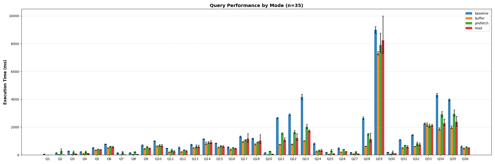
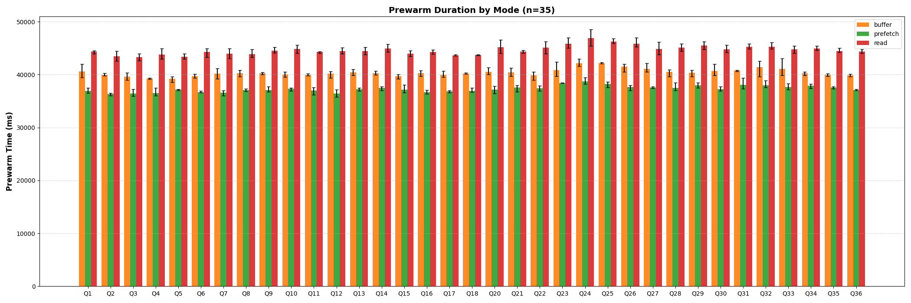

# DuckDB Cache Prewarm

A DuckDB extension that preloads table data blocks into the buffer pool or OS page cache, inspired by PostgreSQL's [`pg_prewarm`](https://www.postgresql.org/docs/current/pgprewarm.html) extension.

## Installation

```sql
FORCE INSTALL cache_prewarm FROM community;
LOAD cache_prewarm;
```

## Usage

```sql
-- Basic usage: prewarm a table into DuckDB's buffer pool
SELECT prewarm('table_name');

-- With explicit mode
SELECT prewarm('table_name', 'buffer');

-- With schema specification
SELECT prewarm('table_name', 'buffer', 'my_schema');
```

## Prewarm Modes

| Mode | Description |
|------|-------------|
| `buffer` | **(Default)** Load blocks into DuckDB's buffer pool with pin/unpin. Blocks stay in the buffer pool until evicted by normal buffer management. |
| `read` | Synchronously read blocks from disk into temporary process memory. This warms the OS page cache but does not use DuckDB's buffer pool. |
| `prefetch` | Issue OS-specific prefetch hints against the database file to warm the OS page cache for the table's blocks. No windows support for now |

## Benchmark

ClickBench benchmark results:




Memory: 31 GB
CPU cores: 16
CPU: AMD EPYC 7282 16-Core Processor

Check `bench/README.md` for details.

## Example

```sql
CREATE TABLE events (
    event_id BIGINT,
    user_id INTEGER,
    session_id VARCHAR,
    event_type VARCHAR,
    event_data VARCHAR,
    timestamp TIMESTAMP,
    value DOUBLE
);

INSERT INTO events
SELECT
    i AS event_id,
    (random() * 10000)::INTEGER AS user_id,
    'session_' || (random() * 5000)::INTEGER AS session_id,
    (ARRAY['click', 'view', 'purchase', 'signup', 'logout'])[1 + (random() * 4)::INTEGER] AS event_type,
    'data_' || (random() * 1000)::INTEGER AS event_data,
    '2024-01-01 00:00:00'::TIMESTAMP + INTERVAL (i) SECOND AS timestamp,
    random() * 1000 AS value
FROM range(500000) t(i);

-- Use Checkpoint to ensure the blocks are written to disk or restart the database
CHECKPOINT;
┌─────────┐
│ Success │
│ boolean │
├─────────┤
│ 0 rows  │
└─────────┘

-- Prewarm the duckdb cache for the events table
-- the result is the number of blocks prewarmed, which may vary depending on how the compression is applied to the table
-- NOTICE that, the result is mostly accurate and only for reference
SELECT prewarm('events'); -- or prewarm('events', 'buffer')
┌─────────────────────┐
│ prewarm('events')   │
│        int64        │
├─────────────────────┤
│         17          │
└─────────────────────┘

-- Prewarm the os page cache for the events table using the read strategy
SELECT prewarm('events', 'read');
┌───────────────────────────┐
│ prewarm('events', 'read') │
│           int64           │
├───────────────────────────┤
│            19             │
└───────────────────────────┘

-- Prewarm the os page cache for the events table using the prefetch strategy
-- which will use the OS-specific prefetch hints to prefetch the blocks into the page cache
SELECT prewarm('events', 'prefetch');
┌───────────────────────────────┐
│ prewarm('events', 'prefetch') │
│           int64               │
├───────────────────────────────┤
│              24               │
└───────────────────────────────┘
```

> **Note:** The returned block count may vary depending on compression and data layout. The count is approximate and for reference only.

## When to Use

- **Cold start optimization**: Prewarm frequently accessed tables after database restart
- **Predictable query latency**: Eliminate first-query cold cache penalties
- **Batch job preparation**: Warm up tables before running analytics workloads
- **OS page cache warming**: Use `read` or `prefetch` mode to warm the OS file cache for scenarios where DuckDB's buffer pool is not the bottleneck

## Limitations

- Prewarming requires blocks to be flushed to disk first (use `CHECKPOINT` if needed)
- Block counts are approximate due to compression and partial blocks

## Roadmap

- [ ] Support prewarm with block ID range
- [ ] Support prewarm for indexes
- [ ] Remote table and file support (leverage `cache_httpfs`)
- [ ] Autoprewarm (automatic cache warming on startup, similar to pg_prewarm's `autoprewarm`)

## License

MIT License - see [LICENSE](LICENSE) for details.

## References

- [PostgreSQL pg_prewarm documentation](https://www.postgresql.org/docs/current/pgprewarm.html)
- [pg_prewarm source code](https://github.com/postgres/postgres/tree/master/contrib/pg_prewarm)
