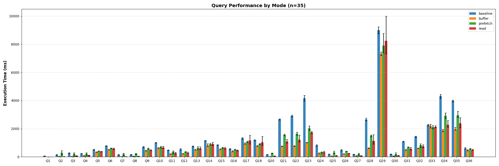
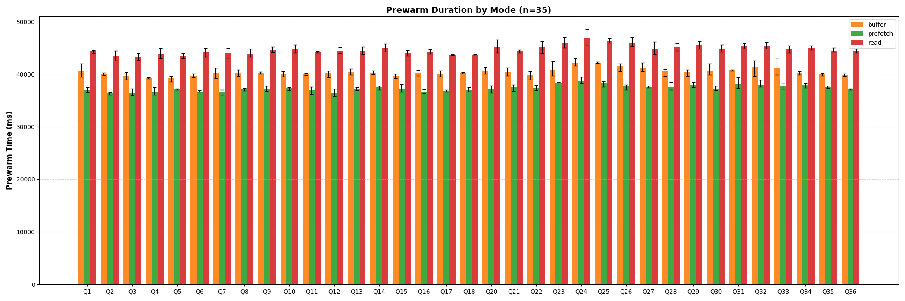

# DuckDB Cache Prewarm

A DuckDB extension that preloads table data blocks into the buffer pool or OS page cache, inspired by PostgreSQL's [`pg_prewarm`](https://www.postgresql.org/docs/current/pgprewarm.html) extension.

## Installation

```sql
FORCE INSTALL cache_prewarm FROM community;
LOAD cache_prewarm;
```

## Usage

```sql
-- Basic usage: prewarm a table into DuckDB's buffer pool
SELECT prewarm('table_name');

-- With explicit mode
SELECT prewarm('table_name', 'buffer');

-- With size limit (human-readable format)
SELECT prewarm('table_name', 'buffer', '1GB');
SELECT prewarm('table_name', 'buffer', '100MB');

-- With size limit (raw bytes)
SELECT prewarm('table_name', 'buffer', 1000000);

-- With qualified table name (schema.table or database.schema.table)
SELECT prewarm('my_schema.table_name');
SELECT prewarm('my_database.my_schema.table_name', 'prefetch');
```

### Remote Prewarm

```sql
-- Prewarm a remote file into the on-disk cache
SELECT prewarm_remote('https://example.com/data/file.parquet');

-- Prewarm with a glob pattern (multiple files)
SELECT prewarm_remote('https://example.com/data/*.parquet');

-- With size limit (raw bytes or human-readable string)
SELECT prewarm_remote('https://example.com/data/file.parquet', 1000000);
SELECT prewarm_remote('https://example.com/data/file.parquet', '100MB');
```

> **Note:** `prewarm_remote` requires `cache_httpfs` to be configured (e.g., `SET cache_httpfs_type='on_disk'`). It returns the precise number of bytes prewarmed.

## Prewarm Modes

| Mode | Description |
|------|-------------|
| `buffer` | **(Default)** Load blocks into DuckDB's buffer pool with pin/unpin. Blocks stay in the buffer pool until evicted by normal buffer management. |
| `read` | Synchronously read blocks from disk into temporary process memory. This warms the OS page cache but does not use DuckDB's buffer pool. |
| `prefetch` | Issue OS-specific prefetch hints against the database file to warm the OS page cache for the table's blocks. No windows support for now |

> **Note:** All modes use at most **80% of currently available** buffer pool memory (after subtracting what is already in use). It will automatically limit the number of blocks that can be prewarmed to avoid exhausting the buffer pool or the OS page cache. Consider increasing the `memory_limit` to prewarm more data.

## Benchmark

ClickBench benchmark results:




Memory: 31 GB
CPU cores: 16
CPU: AMD EPYC 7282 16-Core Processor

Check `bench/README.md` for details.

## Example

```sql
CREATE TABLE events (
    event_id BIGINT,
    user_id INTEGER,
    session_id VARCHAR,
    event_type VARCHAR,
    event_data VARCHAR,
    timestamp TIMESTAMP,
    value DOUBLE
);

INSERT INTO events
SELECT
    i AS event_id,
    (random() * 10000)::INTEGER AS user_id,
    'session_' || (random() * 5000)::INTEGER AS session_id,
    (ARRAY['click', 'view', 'purchase', 'signup', 'logout'])[1 + (random() * 4)::INTEGER] AS event_type,
    'data_' || (random() * 1000)::INTEGER AS event_data,
    '2024-01-01 00:00:00'::TIMESTAMP + INTERVAL (i) SECOND AS timestamp,
    random() * 1000 AS value
FROM range(500000) t(i);

-- Use Checkpoint to ensure the blocks are written to disk or restart the database
CHECKPOINT;
┌─────────┐
│ Success │
│ boolean │
├─────────┤
│ 0 rows  │
└─────────┘

-- Prewarm the duckdb cache for the events table
-- The return value is the number of bytes prewarmed
-- It may vary depending on how compression is applied to the table
SELECT prewarm('events'); -- or prewarm('events', 'buffer')
┌─────────────────────┐
│ prewarm('events')   │
│        int64        │
├─────────────────────┤
│       4456448       │
└─────────────────────┘

-- Prewarm the OS page cache for the events table using the read strategy
SELECT prewarm('events', 'read');
┌───────────────────────────┐
│ prewarm('events', 'read') │
│           int64           │
├───────────────────────────┤
│          4980736          │
└───────────────────────────┘

-- Prewarm the OS page cache for the events table using the prefetch strategy
-- Uses OS-specific prefetch hints to prefetch the blocks into the page cache
SELECT prewarm('events', 'prefetch');
┌───────────────────────────────┐
│ prewarm('events', 'prefetch') │
│             int64             │
├───────────────────────────────┤
│           6291456             │
└───────────────────────────────┘


#===--------------------------------------------------------------------===#
# Remote Prewarm Example
#===--------------------------------------------------------------------===#

-- Configure cache_httpfs for on-disk caching
SET cache_httpfs_type='on_disk';
SET cache_httpfs_cache_directory='/tmp/duckdb_cache';

-- Prewarm a remote CSV file (16222 bytes) into on-disk cache
-- Returns precise bytes prewarmed, accounting for partial blocks
SELECT prewarm_remote('https://raw.githubusercontent.com/dentiny/duck-read-cache-fs/refs/heads/main/test/data/stock-exchanges.csv');
┌────────────────────────┐
│    prewarm_remote()    │
│         int64          │
├────────────────────────┤
│                  16222 │
└────────────────────────┘

-- Prewarm with a size limit using human-readable string
SET cache_httpfs_cache_block_size=1000;
SELECT prewarm_remote('https://raw.githubusercontent.com/dentiny/duck-read-cache-fs/refs/heads/main/test/data/stock-exchanges.csv', '3KB');
┌────────────────────────┐
│    prewarm_remote()    │
│         int64          │
├────────────────────────┤
│                   3000 │
└────────────────────────┘
```

> **Note:** The returned byte count may vary depending on compression and data layout. The count is approximate and for reference only.

## Remote Prewarm

The `prewarm_remote` function preloads remote file data into the local cache managed by [`cache_httpfs`](https://github.com/dentiny/duck-read-cache-fs). This is useful for warming up cached remote files (e.g., S3, HTTP) before querying them.

```sql
-- Prewarm a remote file into the local cache
SELECT prewarm_remote('https://example.com/data.parquet');

-- Prewarm with a maximum number of bytes
SELECT prewarm_remote('https://example.com/data.parquet', 100);

-- Glob pattern matching is supported
SELECT prewarm_remote('/tmp/cache_httpfs/data_*.csv');
```

| Parameter | Description |
|-----------|-------------|
| `pattern` | **(Required)** URL or file path pattern to prewarm. Supports glob patterns. |
| `max_bytes` | **(Optional)** Maximum number of bytes to prewarm. Defaults to unlimited. |

> **Note:** `prewarm_remote` requires the `cache_httpfs` extension to be loaded. The block size is determined by the `cache_httpfs_cache_block_size` setting.
> **Note:** The returned byte count includes all blocks processed, even if they were already cached in memory or on local disk. Blocks that are already warm are still counted toward the prewarmed bytes total.

## When to Use

- **Cold start optimization**: Prewarm frequently accessed tables after database restart
- **Predictable query latency**: Eliminate first-query cold cache penalties
- **OS page cache warming**: Use `read` or `prefetch` mode to warm the OS file cache for scenarios where DuckDB's buffer pool is a bottleneck

## Roadmap

- [ ] Support prewarm for indexes
- [x] Remote table and file support (leverage `cache_httpfs`) https://github.com/dentiny/duckdb-cache-prewarm/issues/16
- [ ] Autoprewarm (automatic cache warming on startup, similar to pg_prewarm's `autoprewarm`)

## License

MIT License - see [LICENSE](LICENSE) for details.

## References

- [PostgreSQL pg_prewarm documentation](https://www.postgresql.org/docs/current/pgprewarm.html)
- [pg_prewarm source code](https://github.com/postgres/postgres/tree/master/contrib/pg_prewarm)
